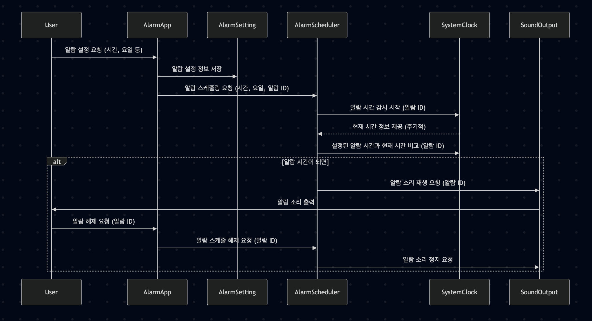

# 소프트웨어공학_개인과제
### 일상 속 소프트웨어 사용 사례: 알람 설정

**a. 알람 설정 시퀀스 다이어그램**

**b. 샘플코드: alarm.py**

**c. 샘플코드의 모듈 평가 결과**

### AlarmSetting 클래스

| AlarmSetting | 정도 |
|---|---|
| 응집도     | 높음 |
| 결합도     | 낮음 |

#### 응집도 높음
* ##### 알람의 속성(시간, 요일, 활성화 여부)을 저장하고 관리하는 단일한 목적을 가지고 있으며, 클래스의 모든 요소가 이 목적과 관련되어 있습니다.
#### 결합도 낮음
* ##### AlarmApp과 AlarmScheduler는 AlarmSetting 객체를 파라미터로 전달하여 사용하여, 단순히 데이터 공유 형태이므로 결합도가 낮습니다.

### AlarmScheduler 클래스

| AlarmScheduler | 정도 |
|---|---|
| 응집도     | 높음 |
| 결합도     | 중간 |

#### 응집도 높음
* ##### 스케쥴링이라는 핵심 기능을 관리합니다.
#### 결합도 중간
* ##### AlarmApp으로부터 AlarmSetting 객체를 받아 스케쥴링하므로 자료 결합도를 가집니다.
* ##### AlarmApp의 handle_alarm_triggered 메서드를 호출하여 알람 발생을 알리므로 제어 결합도를 가집니다.

### AlarmApp 클래스

| AlarmApp | 정도 |
|---|---|
| 응집도     | 높음 |
| 결합도     | 중간 |

#### 응집도 높음
* ##### 알람 앱의 주요 동작을 관리합니다.
#### 결합도 중간
* ##### AlarmSetting 객체를 생성하여 AlarmScheduler에 전달하므로 자료 결합도를 가집니다.
* ##### AlarmScheduler로부터 알람 발생 알림을 받는 제어 결합도를 가집니다.
